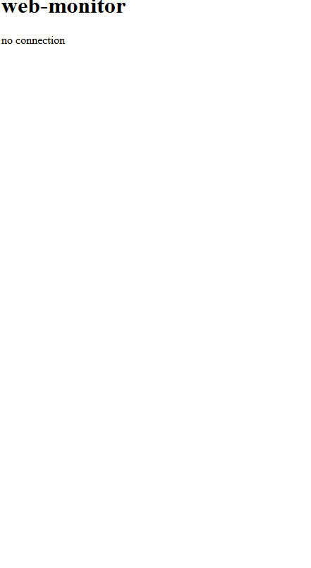

# web-monitor

Little discovery project : a web application to display computer informations (CPU, RAM, OS...) using HTTP and websocket.

## Description

The front-end and back-end communicate via HTTP and websocket. Static information (platform, number of CPU cores... etc) is sent via HTTP when the web application opens. Dynamic information (RAM, CPU times... etc) is sent continuously via websocket.  

  



  

Screenshot with the top of the page only.

## Getting started

#### Prerequisites
* python 3.8
* pip

#### Installation

```
git clone https://github.com/Gyskard/web-monitor
cd ./web-monitor/src/back
pip install -r requirements.txt
uvicorn main:app --reload
```

## Built With

* [VueJS](https://vuejs.org/) - the ProgressiveJavaScript Framework.
* [Axios](https://github.com/axios/axios) - promise based HTTP client for the browser and node.js.
* [FastAPI](https://fastapi.tiangolo.com/) - FastAPI framework, high performance, easy to learn, fast to code, ready for production.

## Authors

* **Thomas Margueritat** - *Initial work* - [Gyskard](https://github.com/Gyskard)

## License

This project is licensed under the MIT License - see the [LICENSE.md](LICENSE) file for details

